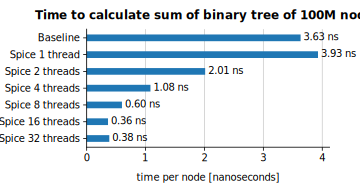
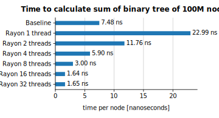
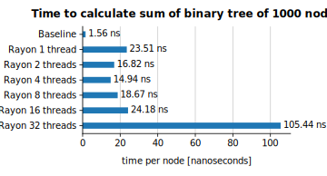
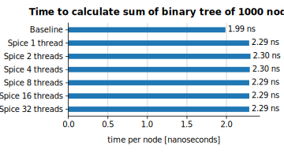

# Spice: Parallelism with sub-nanosecond overhead



**Spice** uses [_heartbeat scheduling_][hb] to accomplish extremely efficient parallelism in Zig:

- **Sub-nanosecond overhead:**
  Turning your function into a parallelism-enabled function adds less than a nanosecond of overhead.
- **Contention-free:**
  Threads will never compete (i.e. spin) over the same work.
  Adding more threads to the system will not make your program any slower, but the extra threads might be completely idle since there's nothing useful to do.

The benchmark in the figure above (summing over the nodes in a binary tree) is typically one of the worst cases for parallelism frameworks:
The actual operation is extremely fast so any sort of overhead will have a measurable impact.

Here's the exact same benchmark in [Rayon][rayon], an excellent library in Rust which uses work-stealing fork/join:



The overhead here is roughly ~15 ns (from 7.48 ns to 22.99 ns) which means that at 4 threads we're "back" to the sequential performance - just using four times as much CPU.
Luckily we _are_ able to get linear speed-up (in terms of threads) initially.
These benchmarks were ran on a `c4-standard-16` instance in Google Cloud with 16 cores.
Rayon itself shows a nice ~14x speed-up (from 22.99 ns to 1.64 ns) at 16 threads, but compared to the _baseline_ this ends up only being ~4.5x due to the overhead.

In comparison, Spice scales slightly worse:
It only got ~11x speed-up when going from 1 to 16 threads.
However, due its low overhead this is also essentially the speed-up compared to the baseline.

(It's not entirely clear why the Zig baseline implementation is twice as fast as the Rust implementation.
The [compiled assembly (godbolt)][rust-vs-zig] show that Rust saves five registers on the stack while Zig only saves three, but why?
For the purpose of this benchmark it shouldn't matter since we're only comparing against the baseline of each language.)

It becomes even more interesting if we're summing the nodes of a much smaller tree:



In this scenario we have a very short duration of our program:
The baseline implementation takes 1.56 _microseconds_ in total to run.
For some reason the overhead is a bit higher (~19 ns), but more concerningly we see that performance becomes _worse_ the _more_ threads we're adding.
At 32 threads it's in total **60 times slower**.

(In this case we're using 32 threads on a machine which only has 16 cores.
It's not given that we would see the same slowdown for a machine with 32 cores.
Nonetheless, this scaling behavior is concerning.)

The conventional wisdom for parallelism therefore ends up being "it's not worth it unless you have _enough work_ to parallelize".
The example above is typically presented as a "bad fit for parallelism".
This is understandable and pragmatic, but in practice it makes it a lot more difficult to _actually_ parallelize your code:

- What exactly is "enough work"?
  You might need to do a lot of benchmarking with different types of input to understand this.
- It might be difficult to detect how much work a certain input does.
  For instance, in our binary tree we don't know the full size of it.
  There's no obvious way for us to say "if the tree is small enough, don't run the parallelized code" since by only looking at the root we don't the size of it.
- As we've seen, the potential slowdown can be extreme.
  What if 90% of your workload is like this?
- As your program evolves and your code does more (or less) _things_, the definition of "enough work" will also naturally change.

The goal of Spice is for you **to never have to worry about your program becoming slower by making it parallel**.
If you're looking to maximize the performance you should of course do elaborate benchmarking, but _generally_ with Spice you can add parallelism and there will be _practically_ no overhead.

The last example of summing over 1000 nodes behaves as follows in Spice:



What's happening here is that it's discovering that the duration is too short so none of the multi-threading kicks in.
All the extra threads here are sleeping, giving the cores time to execute other programs.

Spice is **primarily a research project**.
Read along to learn more about it, but if you're considering using it in production you should be aware of its [many limitations](#limitations).

_(See the [bench/](bench/) directory for more details about these specific benchmarks.)_

## Table of Contents

- [Using Spice](#using-spice)
- [Work-stealing and its inefficiencies](#work-stealing-and-its-inefficiencies)
- [Implementation details](#implementation-details)
  - [Optimizing for static dispatch](#optimizing-for-static-dispatch)
  - [Low-overhead heartbeating signaling](#low-overhead-heartbeating-signaling)
  - [Global mutex is fine when there's no contention](#global-mutex-is-fine-when-theres-no-contention)
  - [Branch-free doubly-linked list](#branch-free-doubly-linked-list)
  - [Minimizing the stack usage](#minimizing-the-stack-usage)
  - [Passing values around in registers](#passing-values-around-in-registers)
- [Benchmarks](#benchmarks)
- [Acknowledgments](#acknowledgments)
- [Limitations](#limitations)
- [FAQ](#faq)

## Using Spice

The following example demonstrates how Spice works:

```zig
const spice = @import("spice");

// (1) Add task as a parameter.
fn sum(t: *spice.Task, node: *const Node) i64 {
    var res: i64 = node.val;

    if (node.left) |left_child| {
        if (node.right) |right_child| {
            var fut = spice.Future(*const Node, i64).init();

            // (3) Call `fork` to set up work for another thread.
            fut.fork(t, sum, right_child);

            // (4) Do some work yourself.
            res += t.call(i64, sum, left_child);

            if (fut.join(t)) |val| {
                // (5) Wait for the other thread to complete the work.
                res += val;
            } else {
                // (6) ... or do it yourself.
                res += t.call(i64, sum, right_child);
            }
            return res;
        }

        res += t.call(i64, sum, left_child);
    }

    if (node.right) |right_child| {
        // (2) Recursive calls must use `t.call`
        res += t.call(i64, sum, right_child);
    }

    return res;
}
```

1. Every parallel function needs to take a _task_ as a parameter.
   This is used to coordinate the work.
2. You should never call your function directly, but instead use `t.call` which will call it for you (in the right way).
3. Call `fork` to set up a piece of work which can be done by a different thread.
   This can be called multiple times to set up multiple pieces of work.
4. After that your function should do some meaningful work itself.
5. Call `join` to wait for the work done by the other thread.
6. _However_, `join` might return `null` and this signals that _no other thread picked up the work_.
   In this case you must do the work yourself.

Here we repeat ourselves in step 3 and 6:
Both places we refer to `sum` and `right_child`.
It's possible to hide this duplication by some helper function, _but_ this example demonstrates a core idea behind Spice:

**Not every piece of work comes from the queue.**
You call `fork` to signal that there's something which _can_ be executed by another thread, but if all the other threads are busy then you fallback to executing it as if the fork never happened.

This principle is core to how Spice achieves its low and predictable overhead:
If there's no parallelism possible then all Spice is doing on the hot path is pushing and popping the queue (without ever looking at any of the items).

The actually coordination with other threads happens on a _fixed heartbeat_:
Every 100 microsecond or so a thread will look at its current work queue and dispatch the top-most item to another waiting thread.
Since the heartbeat happens very infrequently (compared to the clock speed) we also don't need to worry so much about what we're doing during the heartbeat.
Even if we spend _hundreds_ of nanoseconds the _total_ overhead becomes small since we do it rarely.

## Work-stealing and its inefficiencies

Spice provides the [fork/join model][fj] which has typically been implementing by using [**work-stealing**][wb].
Let's have a look at work-stealing:

- Every thread have their own local _work queue_.
  Every piece of work in the system gets put onto this queue.
- The same thread will pick up work from this queue and execute it.
  This might lead to more work being added (onto the same queue).
- At some point, the local work queue for a thread will become empty.
  The thread will then attempt to _steal_ work from another thread:
  It takes a chunk of the work from the _end_ of another thread's queue and places it into its own.
- Since each thread pulls work from the _beginning_ of its queue and other thread steals from the _end_, we expect there to be little contention on these queues.

However, there's three major sources of inefficiencies in this design:

**Every piece of work is a _dynamic dispatch_.**
In compiled languages (such as C) function calls are "practically" free due to the capability of statically knowing everything about the called function.
This is a scenario which compilers and CPUs have been optimized for _decades_ to execute efficiently.
Work-stealing systems _don't_ use this functionality, but instead puts every piece of work into generic "call this dynamic function".
It's a small piece of overhead, but it does add up.

**The "local" work queue isn't really local.**
Yes, it's true that every thread have a single queue that they will push work onto, _but_ this is far from a "local" queue as is typically described in concurrent algorithms.
This is a queue in which _every_ thread at _every_ point might steal from.
In reality, work-stealing systems with N threads have N global queues, where each queue only has a single producer, but everyone is a consumer.
Why does this distinction matter?
_Because all operations on these queues have to use atomic operations._
Atomic operations, especially stores, are far more expensive than regular, _local_ stores.

**Spinning works great … until it doesn't.**
The queues in work-stealing systems are typically implemented using _spinning_:
Every thread will optimistically try to acquire a single item from the queue, and if there's a contention with another thread it will _try again_ in a loop.
This typically gives great performance … **until it doesn't**.
It can be very hard to reason about this or replicate it since under one set of conditions everything is fine, but _suddenly_ during contention the system will slow down to a halt (i.e. 10x-100x slower).

Spice directly tackles all of these inefficiencies:

1. The dynamic dispatch of the work queue is only used when work is sent to another thread.
   Work done _within_ a single thread will use regular function calls outside of the work queue.
2. The work queue is truly local:
   Pushing to it involves (1) one memory store to a pointer to somewhere on the stack, (2) one memory store to the current stack frame, (3) one register store.
   None of these operations need to synchronize with other threads.
3. There isn't a single `while`-loop in Spice which doesn't also contain a `wait()`-call which will suspend the thread.
   There is no spinning.

## Implementation details

Let's dive further into how Spice is implemented to achieve its efficient parallelism.

### Optimizing for static dispatch

A fork/join program has a set of code blocks which are executed in parallel and once they finish the `join` action completes:

```
join(
  fork { code1 }
  fork { code2 }
  fork { code3 }
)
```

In Spice this is represented as:

```
job1 = fork { code1 }  // Place on the queue
job2 = fork { code2 }  // Place on the queue

code3 // Run right away

if (job2.isExecuting()) {
  // Job was picked up by another thread. Wait for it.
  job2.wait()
} else {
  code2
}

if (job1.isExecuting()) {
  // Job was picked up by another thread. Wait for it.
  job1.wait()
} else {
  code1
}
```

Notice that `code1` and `code2` has been duplicated_inside the function.
This is actually a _good_ thing.
Most of the time the job will _not_ be picked up by another thread.
In this case, our program nicely turns into the sequential version (although in reverse order) with a few extra branches which are all very predictable.
This is friendly both for the code optimizer (e.g. it can now inline the function call) and the CPU.

### Low-overhead heartbeating signaling

The core idea of heartbeat scheduling is to do scheduling _locally_ and at a _low frequency_:
Every 100 microsecond or so we'd like every thread to look at it local work queue and send work to a different thread.
The low frequency is key to eliminating overall overhead.
If we're only doing something every 100 microsecond we can actually spend 100 nanoseconds (an eternity!) and still only introduce 0.1% overhead.

Operating systems have built-in support for _signaling_, but these are very hard to reason about.
The user code gets paused at _any_ random point and it's hard to safely continue running.
For this reason, Spice uses a cooperative approach instead:
The user code have to call `tick()` and this detects whether a heartbeat should happen.
This function call is automatically called for you whenever you use the `call`-helper.

It's critical that this function is efficient when a heartbeat **isn't** happening.
This is after all the common case (as the heartbeat is only happening every ~100 microsecond).

```zig
pub inline fn tick(self: *Task) void {
    if (self.worker.heartbeat.load(.monotonic)) {
        self.worker.pool.heartbeat(self.worker);
    }
}
```

In Spice we spawn a separate heartbeat thread whose sole purpose is to periodically flip the thread's atomic heartbeat value from `false` to `true`.
The `tick()` function then reads this atomic value and starts its heartbeat code when it's `true`.

A key part of reducing the overhead of the ticking is to make sure the heartbeat function itself is marked as _cold_.
This causes the presence of this function call to not use up any registers.
Without this the overhead is significantly higher.

### Global mutex is fine when there's no contention

If you look inside the codebase of Spice you will find that each thread pool has a single mutex which is locked all over the place.
An immediate reaction would be "oh no, a global mutex is terrible" and you might be tempted to replace it.

_However_, there's no problem with a global mutex _until you're being blocked_.
And you can only be blocked if two conditions occur:

1. A thread is holding the lock for a _long_ time.
2. There's concurrent threads trying to acquire the lock at the same time.

**None** of these are true for Spice.
The heartbeating ensures that typically only a single thread is executing a heartbeat.
In addition, no user code is executed while the lock is held.
We're only protecting trivial simple memory reads/writes which will complete in constant time.

### Branch-free doubly-linked list

We're using a doubly-linked list to keep track of the work queue:
`fork()` appends to the end, `join()` pops from the end (if it's still there), and we pop from the _beginning_ when we want to send work to a background worker.

[Appending into a doubly-linked list](https://github.com/ziglang/zig/blob/cb308ba3ac2d7e3735d1cb42ef085edb1e6db723/lib/std/linked_list.zig#L267-L275) typically looks like this:

```zig
pub fn append(list: *Self, new_node: *Node) void {
    if (list.last) |last| {
        // Insert after last.
        list.insertAfter(last, new_node);
    } else {
        // Empty list.
        list.prepend(new_node);
    }
}
```

Notice that there's a conditional here: If the list is empty we need to do something special.
Most of the time the list will of course _not_ be empty.
To eliminate the branch we can make sure that the list is _never_ empty.
We define a sentinel node (the "head") which always represents the beginning of the list.
The tail pointer will start by pointing to this head node.

This means that both pushing and popping is completely branch-free and these are operations we do at _every_ recursive function call.

### Minimizing the stack usage

A `Future` in Spice has two possible states: It's either _queued_ or _executing_.
The heartbeat is responsible for taking a _queued_ future and start _executing_ it.
And as we already know: Heartbeating happens rarely so we expect many futures to be queued without executing.

An early prototype of Spice used a _tagged union_ to store the future on the stack.
This turns out to be suboptimal because (1) stack usage matters for performance (at least in this benchmark) and (2) there's quite a lot of additional state needed to keep track of futures which are _executing_.

To minimize stack usage Spice therefore uses two techniques:

1. Execution state is placed in a separate (pool-allocated) struct.
   The queued (but not executed) futures therefore does not need to consume any of this space.
2. We manually create a tagged union where we use the fact that the _executing_ state only needs a single pointer while the _queued_ state is guaranteed to have a `prev` pointer.
   Whether the first field is `null` therefore decides which of these it is.
   (Maybe a smart enough compiler would be able to this optimization for us.)

```zig
const Future = struct {
    prev_or_null: ?*anyopaque,
    next_or_state: ?*anyopaque,
}

// A future which is _queued_ has:
//   prev_or_null = pointer to prev future
//   next_or_state = pointer to next future

// A future which is _executing_ has:
//   prev_or_null = null
//   next_or_state = ExecuteState

const ExecuteState = struct {
    requester: *Worker,
    done: std.Thread.ResetEvent = .{},
    result: ResultType,
    // Any number of fields.
}
```

### Passing values around in registers

Spice works with a `Task` struct which has two fields:
A pointer to the owning worker and a pointer to tail of the work queue.
For optimal performance these should be passed as registers across all function boundaries.
However, with LLVM, passing a struct will very often cause it be passed on the stack.

To work around this we define a _separate_ function where `worker` and `job_tail` are actual parameters.
We place the parameters into a struct and pass a pointer to this into the user-defined function.
This function call we make sure is always being inlined:

```zig
fn callWithContext(
    worker: *Worker,
    job_tail: *Job,
    comptime T: type,
    func: anytype,
    arg: anytype,
) T {
    var t = Task{
        .worker = worker,
        .job_tail = job_tail,
    };
    return @call(.always_inline, func, .{
        &t,
        arg,
    });
}
```

This causes the `callWithContext`-function to be the _actual_ function which LLVM works on, and since this has pointers are parameters it will happily pass these directly into registers.

## Benchmarks

The initial development of Spice has been focused around a single benchmark which is described in detail in [bench/](bench/).

## Acknowledgments

Spice was made possible thanks to the research into _heartbeat scheduling_:

["The best multicore-parallelization refactoring you've never heard of"](https://arxiv.org/abs/2307.10556) gives an _excellent_ introduction into the concepts of heartbeat scheduling.
It's a very short paper which focuses entirely on a single use case, but describes everything in a manner which can be generalized.
The solution presented in this paper is based around turning all the code into continuation-passing style which enables switching between sequential and parallel execution.
Spice started out as an experiment of this approach, but this turned out to have quite high overhead (>10 nanosecond).

Going backwards in time, ["Heartbeat scheduling: provable efficiency for nested parallelism"](https://www.chargueraud.org/research/2018/heartbeat/heartbeat.pdf) was the first paper introducing "heartbeat scheduling".
This paper provides excellent information about the concepts, but the implementation is based around integrating this into an interpreter and focus is primarily on the theoretical guarantees as opposed to raw performance.

["Task parallel assembly language for uncompromising parallelism"](https://paragon.cs.northwestern.edu/papers/2021-PLDI-TPAL-Rainey.pdf) is a follow-up paper which improves the performance by defining a custom assembly language and using OS signaling for heartbeats.
This is a fascinating line of research, but it's difficult to integrate into an existing language.

## Limitations

There's _many_ limitations of the current implementation of Spice:

- **Rough edges when you're using it wrong:** Spice is quite peculiar about how it should be used (most notably about `fork` and `join`).
  If you're using it wrong now then weird things could happen.
  This should be improved by adding more compile-time checking, debug-mode assertions, or changing the overall API.
- **Lack of tests:** Spice contains a lot of gnarly concurrent code, but has zero testing coverage.
  This would have be improved before Spice can be responsibly used for critical tasks.
- **Lack of support for arrays/slices:** Probably _the_ most common use case for fine-grained parallelism is to do something for every element of an array/slice.
  There should be native, efficient support for this use case.
- **Lack of documentation:** There's no good documentation of how to use it.
- **Lack of further benchmarks:** This has only been tested on a single small benchmark.
  This benchmark _should_ be quite representative (see [bench/](bench/) for more details), but further benchmarks are needed to validate these findings.
- **@panic-heavy:** Spice is quite optimistic in its error handling and uses `@panic` extensively.
  To be considered a proper Zig library there needs to be way more consideration of how error cases are handled.
- **Lack of testing with ReleaseSafe:**
  `ReleaseSafe` is an extremely nice feature of Zig.
  Further benchmarking and testing is needed to understand how well Spice can work here.

Luckily the whole codebase is ~500 lines so it shouldn't be _too_ difficult to make progress on these areas.

There's currently no plans of doing any active development on Spice to improve this (as the original author don't have the time).
Any improvements in forks and/or re-implementations in other languages are highly encouraged!

## FAQ

**Question: Why is it called "Spice"?**

Answer: This project enables _fine-grained_ parallelism. Sand is extremely fine-grained. Sand forms in dunes. [Spice](<https://en.wikipedia.org/wiki/Melange_(fictional_drug)>).
Also: It's a hot take on parallelism.

**Question: Why is it implemented in Zig?**

Answer: Why not?
This describes a _generic approach_ to parallelism that should be possible to implement in multiple languages.
Maybe I'll end up implementing something similar in another language as well?
I don't know yet.
If you think this is interesting for _your_ language of choice I would encourage you to explore this area.

**Question: But if you did it in Rust we could have _safe_ parallelism?**

Answer:
Yeah, that sounds very cool.
I'm not at all opposed to it.
_That said_, I've been exploring many different techniques and variants while developing Spice.
Many of my initial ideas were definitely not "safe" by any means, but I was able to express these ideas in Zig, look at the assembly and measure the performance in benchmarks.
I'd probably only be able to explore a fraction of the ideas if I was limited by Rust's strict semantics in the _initial_ phase of this project.
If I have to turn this into a production-ready system I might decide to use Rust.

[hb]: https://www.andrew.cmu.edu/user/mrainey/heartbeat/heartbeat.html
[rayon]: https://docs.rs/rayon/latest/rayon/
[wb]: https://en.wikipedia.org/wiki/Work_stealing
[fj]: https://en.wikipedia.org/wiki/Fork%E2%80%93join_model
[rust-vs-zig]: https://godbolt.org/#z:OYLghAFBqd5QCxAYwPYBMCmBRdBLAF1QCcAaPECAMzwBtMA7AQwFtMQByARg9KtQYEAysib0QXACx8BBAKoBnTAAUAHpwAMvAFYTStJg1AAvPMFJL6yAngGVG6AMKpaAVxYMJAZlIOAMngMmABy7gBGmMQgAGykAA6oCoS2DM5uHt7xickCAUGhLBFRsZaY1ilCBEzEBGnunlw%2BpeUCldUEeSHhkTEWVTV1GY197Z0FRTEAlBaorsTI7BxoDAoEANTBGJhrAKReACJrq8Su1rsA7ABCOxoAgmsPawBuYiBreNHSN/eP9FQEbz2ADEAFSbLC7A5rBiuWi0UjfR5rYhmBAAyGg8HbPaHGFwhF3RGPOKuMJrKgMI7uCCWKhvEHLVYbLaTd6fC7XO5IpEvYjIzAKSGHWkAOhetD2nJ%2B3PeVDWNMwtCoIr%2BBFZO3OjmQCDo6A1jn5gp2ACZrlDtbqRQpqZNJUSZXg5QqlSKUcA0erNRbaHrNYbdqacWtvegrTa7VyZfyCHNKcQBRHpRd9t8NSmvFLviSyRS1iwmIEIKynqg8OgOfa1gB6KtrAAqbuAkTWBAQ22tLAAtFRXAwWpSiGsImtZgQSQRKwB9IXMrBhlgQXtYGhBdC2jOp877DjTWicACsvE83F4qE4AC0zEdZvNscavDxSACOFpJtMANYSACcIq40X3XiSMaQHGvuwEABySNIe4cJIR6aKenC8AoIAaE%2BCHTHAsBIGgLBxHQkTkJQuH4fQUTGAQJwMO%2BfB0AQkQoRAYQIaQYSBNUACenCPmxzDEBxADyYTaGUz6PrhbCCAJDC0FxL68FgYSuMAjhiLQKEnqQWD5kY4jyVpeDxuUTwCixmCqGUrj0dxvCBPRMFaPoeBhMQnHOFgLGUXgLA2aQJnEGEiSYPsmA6cAtCBKA8nTFQBjAAoABqeCYAA7gJcSML5/CCCIYjsFIMiCIoKjqPpujGvohgmGYTlhChkDTKgcQ2AIGmdgJawAEqKpgTBKECfUEKe/kolg9VFhYPX9vYDBOC49R6P4gRdIUPRcFkSQtak81DBtOQMGM3RROtzRbW0Aw7Q0k1WGd/QdMt4xrSMF3pFdqyjA9R0SNMCg3gs336Ae8H6WeHBrKYwAtlR77yrghAkAGD6TLwz6vtMbZMFgUQTZ%2BoEivu5zRBokhfsaX77vunxgYDsHA45oPIah6HRaQWGICgWxw0QZAUNQBHMGwWWyLl4gFdl8hKGoLHlZVRggCcqzXaJKQzXNr0gBVS35F9f57VtgyeBVCSbSkh2rcdJRTbd7QGxrSv9ud93a%2BbEglHdtsVe9NRmxMf4/X9izHKc6xYnsjh1ns2AVpGDziq47D1gSSaqm86VbWHlyoKoYeh144eRwXXjYEnSJumiqfNSkGdZznWxhxHReF8Xm4poSdzZuSlIdhADBbICxrRLnjgfJIkesp2kdspI0fJ5g6wsFZhqwusQa93OceYImSKOms9DrEIqBsBAIbqlCJrRGvmAqpg/wz1GS%2B0CvgZQt3J9b48aaVjve9rAfR8nzOc%2Bl9XSohXlcSspcBTLwDGaYU1I34bhjsmSs8YYzEDjFAx%2BiY0w7hpoeUgx56acE6q4Jkv05gLERsaFGGEPwa2NCKL84FjTgS8F4fcXAuDGg0NENh0FOBwQISxBmFgmao1wWzCAOFD6kUIrzEiBEojEC4OBDQaEaCPwYpQZi%2BleKcV8no/iQkRLWF8hJRgBBpKyRYopZSqk4QaUfNpKqelHL4CMjYEyGlHLmUstZTSdlFQsQii5Nyfd9JeR8ppfygUlAhTChFOWLNYpMHiklVK6VMqaXFiLfK0hxbFSlmVPQBg5YKwILVcajVK6tU4J2A0TUCCdnoCZCUBwvDDUiKNUysABbsEwPgLafkxDx04Nw40PA3z2y2qrW260tYrV9nrFIczlm5E%2Bi7E6VsKju0unoU6OyPrOyWV7WoeyTp3R9mtf2FD2DGl3EDIRINODIlIQQZAawuAilUSKDQsNBkIxNF4e5NDop0OBSKY05wCbnEkOcc4GgEWSGBTTQRhDEIcEZmhcRUyYLUKeUQzFzM0Z%2BQYirSQQA%3D%3D%3D
